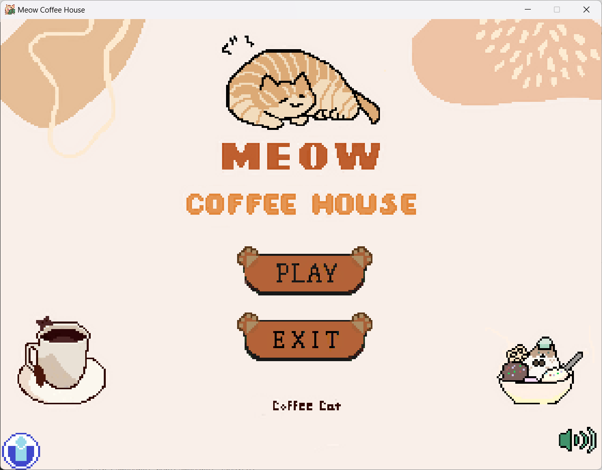
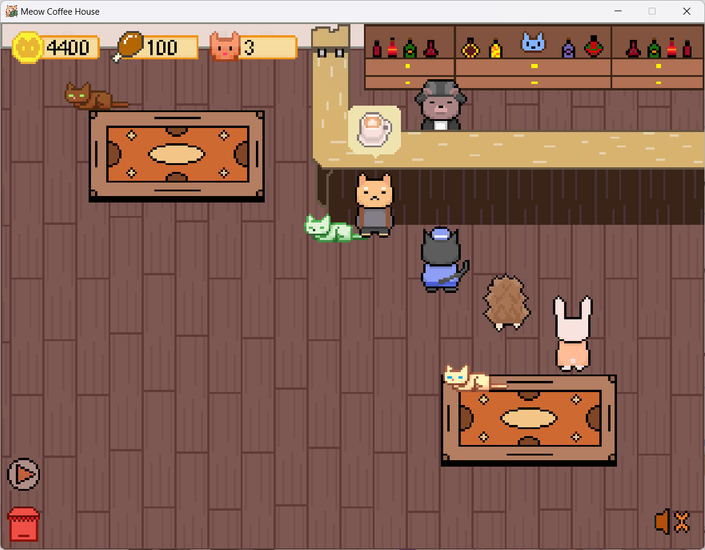
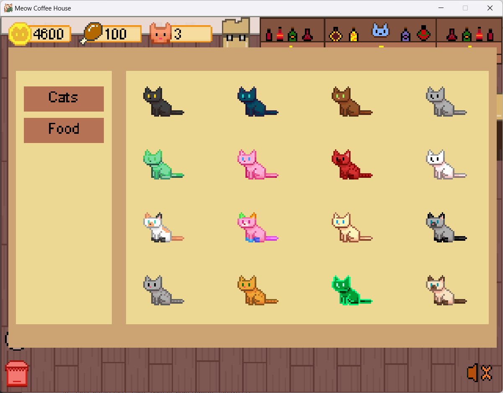
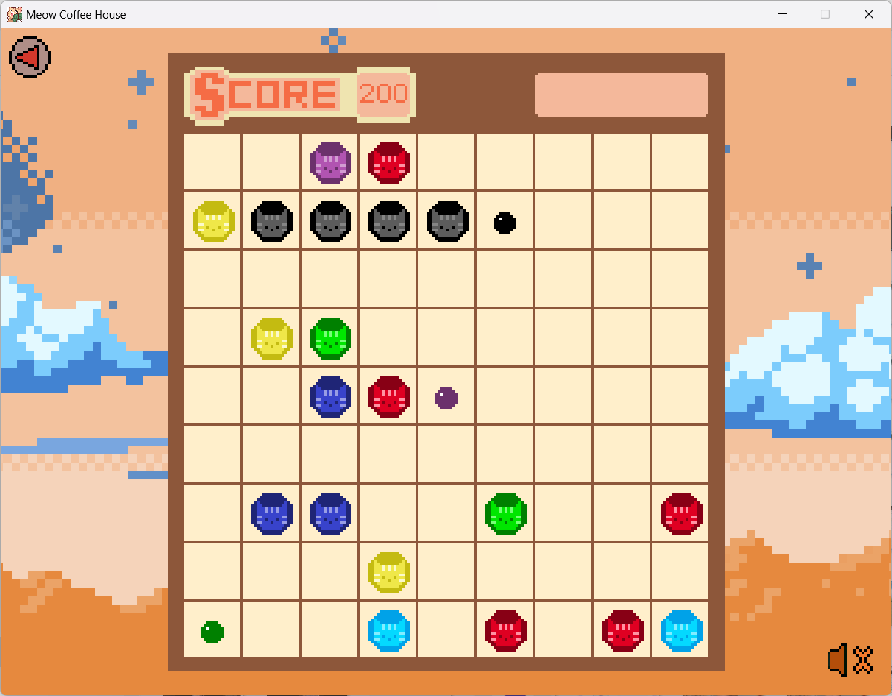
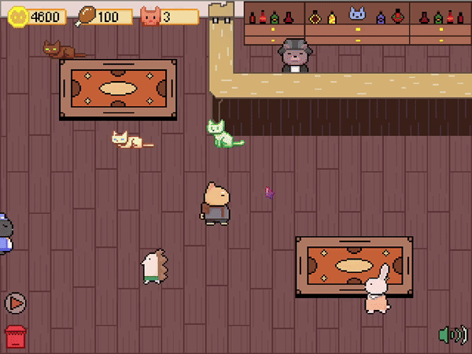
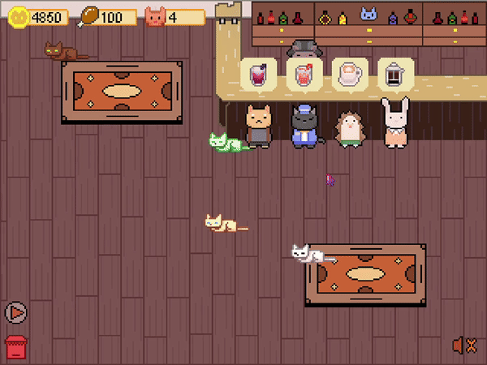
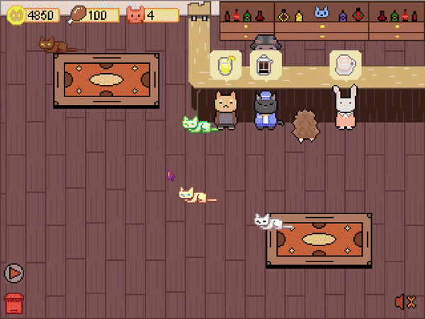

# 🐾 Meow Coffee House

Welcome to **Meow Coffee House**! Manage your own cat-themed coffee shop, where you can play with cats, feed them, and serve food and beverages to customers. You can also earn money by playing a mini-game called "Line98," which you can use to buy more cats and supplies. Your cats will interact with you in delightful ways, adding charm and fun to your shop.

## 📖 Table of Contents
- [Game Overview](#game-overview)
- [Features](#features)
- [Getting Started](#getting-started)
  - [Installation](#installation)
  - [How to Play](#how-to-play)
- [In-Game Mechanics](#in-game-mechanics)
  - [Cats](#cats)
  - [Customer Service](#customer-service)
  - [Shop Management](#shop-management)
  - [Mini-Game: Line98](#mini-game-line98)
  - [Economy](#economy)
- [States](#states)
  - [Menu State](#menu-state)
  - [Ingame State](#ingame-state)
  - [Shop State](#shop-state)
  - [Line98 State](#line98-state)
- [Demo](#demo)
  - [Cat Interactions](#cat-interactions)
  - [Customer Service](#customer-service)
  - [Line98 Mini-Game](#line98-mini-game)
- [Team Members](#team-members)
- [Future Updates](#future-updates)
- [Contributing](#contributing)
- [License](#license)
- [Contact](#contact)

## 🐱 Game Overview
**Meow Coffee House** lets you create a cozy environment where customers can enjoy food, drinks, and the company of adorable cats. Keep your cats happy, serve customers, and expand your shop by earning money through both your business and the "Line98" mini-game.

## 🌟 Features
- **Play with Cats**: Interact with cats that have unique behaviors. They might move, stand, sit, or sleep.
- **Feed the Cats**: Keep your cats well-fed with a variety of cat foods.
- **Serve Customers**: Prepare and serve food and beverages to customers.
- **Shop Management**: Buy new cats, food, and upgrades to grow your business.
- **Mini-Game "Line98"**: Play "Line98" to earn extra money for buying food and cats.
- **Interactive Cats**: Click on the cats to see them randomly react, such as moving, standing, or sitting. Their normal state is sleeping.

## 🚀 Getting Started

### Installation
1. Clone the repository:
   ```bash
   git clone https://github.com/meowie2k3/Meo-coffee-house.git
   ```
2. Navigate to the project directory:
   ```bash
   cd Meo-coffee-house
   ```
3. Navigate to the Main:
   ```bash
   cd src/Main
   ```
4. Open the file named ```game.java``` and choose "Run Java"

### How to Play
1. **Interact with Cats**: Move the cursor and click on cats to play with them.
2. **Feed the Cats**: Drag and drop food to the cats to keep them happy.
3. **Serve Customers**: Click on customer orders to prepare and serve food and drinks.
4. **Play Line98**: Access the "Line98" mini-game to earn extra money.
5. **Shop**: Use your earnings to buy new cats, food, and upgrades.

## 🛠️ In-Game Mechanics

### Cats
- There are many kinds of cats, and they will react to your actions on them.
- Their default state is sleeping, but they may move, stand, or sit when interacted with.

### Customer Service
- Manage customer orders efficiently to keep them happy.
- Earn money by serving food and beverages.

### Shop Management
- Expand your coffee shop by buying new cats and upgrading your facilities.
- Keep a variety of cat food in stock to cater to different cats.

### Mini-Game: Line98
- Play the "Line98" puzzle game to earn extra money.
- Use the money to buy cat food and new cats.


### Economy
- Balance your earnings from customer service and the mini-game to grow your shop.
- Invest wisely in upgrades and new items.

## 🖼️ State

### Menu State: 
  
  <div align ="center"></div>

### Ingame State: 
  
  <div align ="center"></div>

### Shop State: 
  
  <div align ="center"></div>
  
### Line98 State: 
  
  <div align ="center"></div>

## 📸 Demo

### Cat Interactions
<div align ="center"></div>

### Customer Service
<div align ="center"></div>

### Line98 Mini-Game
<div align ="center"></div>

## 👥 Team Members
Minh Huy, Tri Dung, Yen Chi, Tan Hung, Khanh Quynh

## 🔮 Future Updates
- **New Foods**: Adding more foods.
- **Expanded Menu**: Introducing more food and drink options for customers.
- **Decorations**: Customization options for your shop.

## 🤝 Contributing
Contributions are welcome! If you’d like to contribute, please fork the repository and create a pull request. For major changes, please open an issue to discuss your ideas first.

## 📜 License


## 📧 Contact
For questions or suggestions, please contact ...
